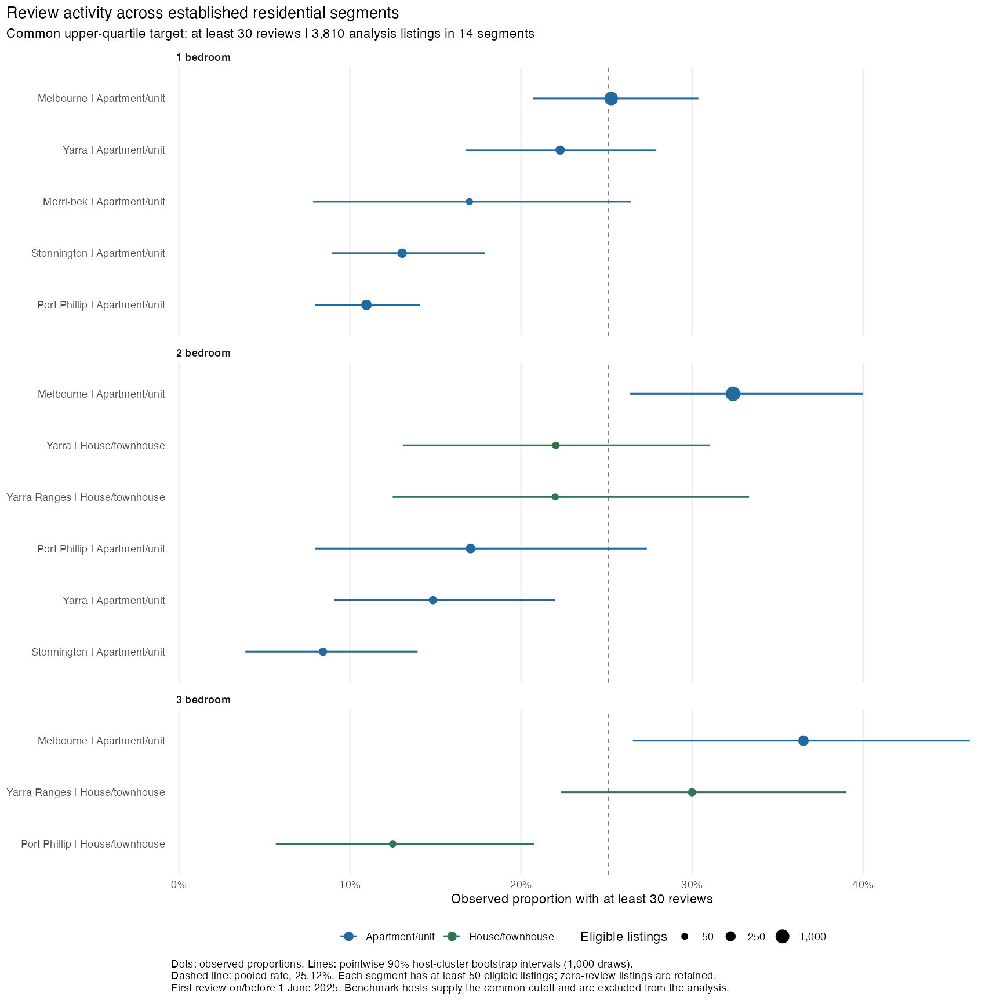

# Melbourne Airbnb Market Screening

Interim Project Report

CMCE30005 Business Analytics Challenge | Semester 2 2026 | TheNextChapter Group 2

Eric Huang, Loc Le, Qihang Sun and Maksym Xu

Repository: https://github.com/Qihang-cpu/CMCE30005-TheNextChapter

## Introduction

Our client leases residential properties and runs them as Airbnb accommodation ("rental arbitrage"), which needs lease and council permission. With limited start-up funds, the client must choose which Melbourne areas and property types to investigate before signing leases; a poor choice ties up money and delays the business.

We use the Inside Airbnb Melbourne snapshot of June 2026 supplied through the subject's LMS (Inside Airbnb, 2026): property details, locations and dated guest reviews. Because a review can only follow a completed stay, dated reviews are a countable record of past guest activity; the calendar cannot separate bookings from host-blocked dates.

The shortlist helps the client decide where to spend limited search and due-diligence time before requesting lease quotations.

## Problem Definition and Objectives

Research questions: (1) Which Melbourne property segments — defined by council area (LGA), apartment or house, and number of bedrooms — show the strongest historical guest-review activity? (2) Can listing attributes improve prediction of high review activity beyond segment averages? "High" means at least 30 reviews in the year before the data were collected, the top quarter of a separate reference group of comparable listings.

Hypotheses: (H1) segments differ materially in the share of listings reaching that level; (H2) a model using listing attributes ranks listings better than the segment average alone.

Objectives: a segment comparison table, a model-versus-average test and a shortlist with uncertainty ranges.

We study entire homes with one to three bedrooms (1–3BR), what a small operator can furnish and let whole; rental units and condos form the apartment group, homes and townhouses the house group. Each segment needs at least 50 listings as minimum comparison support (host counts and resampled ranges are reported); quoted prices of AUD 30–1,500 are an exploratory boundary; and a first review at least 365 days before collection gives at least one year of observable review history, not proof of continuous operation.

We call the share of listings reaching 30 reviews "attainment"; 30 reviews means at least 30 reviewed stays, roughly one every 12 days. Attainment measures review activity, not bookings, occupancy or profit.

## Data Description

The dataset contains 25,728 listings and 1,026,690 reviews, collected between 17 June and 1 July 2026. Its modelled occupancy and revenue fields are built from price, minimum stay and review counts, so ranking on them would only reproduce that construction; we rank on review counts directly.

Cleaning converts price text to numbers, standardises missing values and extracts bathroom and amenity counts; price is missing for 6,553 listings and bedrooms for 4,679. The supplied last-12-months review field spans 366 dates, so we rebuilt counts over exactly 365 days from review dates (Table 1).

Table 1. Sample funnel

| Stage | Listings |
| --- | --- |
| All listings in the dataset | 25,728 |
| Entire homes, 1–3 bedrooms | 16,576 |
| Standard dwelling types | 14,895 |
| Quoted price AUD 30–1,500 | 11,099 |
| First review ≥ 365 days before collection | 6,891 |
| Analysis sample (50+ per segment, reference hosts excluded) | 3,873 |
| Reference group (separate, from the 6,891) | 906 |

The reference group's 75th percentile is 29.75 reviews, giving a threshold of 30. The analysis sample (3,873 listings from 1,726 hosts) has 14 segments across six LGAs and keeps 334 listings with zero annual reviews. Overall, 981 listings (25.33%) reach the threshold, and attainment ranges from 8.25% to 36.60% across segments (Figure 1).



Of the 6,801 listings with no usable price (missing or outside AUD 30–1,500), 82% had no review in the past year, so the priced sample is the more active part of the market. Listings that left Airbnb before collection are absent, which limits generalisation to new entrants.

## Methodology and Analytical Approach

A fixed rule on host identifiers sets aside about 20% of hosts as the reference group that defines the 30-review target; they are excluded from all training and testing. We use five-fold validation, each part tested in turn on a model trained on the other four, with each host's properties kept in one fold so a host with many near-identical apartments cannot sit in both training and test data (scikit-learn developers, n.d.). Missing-value treatment and category encoding are learned from training data only.

Logistic regression is the simple reference; random forest and gradient boosting capture nonlinear patterns. Basic features are location, configuration, capacity, bathrooms and amenity count; an enhanced set adds coordinates, beds and nine amenities. We compare six variants of these models, with and without probability calibration and with and without current price and minimum stay. Review-based predictors, ratings and host badges are excluded.

Every model is compared with a segment-average baseline: each listing gets its segment's attainment among training hosts. AUC is how well the model orders listings that reach the target above those that do not; 0.5 is a coin toss. Average precision summarises precision across prediction thresholds. Brier score is how far its percentages are from what happened; lower is better. R handles cleaning and tables; Python (scikit-learn 1.7.2) runs the models.

No untouched hold-out set exists (model choice used the same folds; item (1) below re-tests it), and property details may have changed during the outcome year.

## Analysis Plan and Progress to Date

Following Week 5 feedback, we dropped the earlier rent-versus-revenue (ROI) design, which needed external rental data, and now compare only within the snapshot. Cleaning, review reconstruction, descriptive analysis and validation are complete.

Table 2. Predictive performance (same sample and folds)

| Predictor | AUC | Average precision | Brier score |
| --- | --- | --- | --- |
| Segment average (training hosts) | 0.581 | 0.285 | 0.1868 |
| Basic property-only logistic | 0.573 | 0.285 | 0.1886 |
| Enhanced property-only random forest | 0.640 | 0.350 | 0.1813 |

The enhanced random forest raises AUC by 0.059 and lowers Brier by 0.0055, beating the segment average in all five folds; across 20 further host splits it wins on AUC every time (mean 0.626, range 0.589–0.648) and on Brier in 16. Adding current price and minimum stay lifts boosting to AUC 0.749 and Brier 0.162, but these are present-day settings, not pre-opening attributes, so they stay out of the shortlist.

Table 3. Initial search candidates (forest predictions from models trained without each listing's host)

| Segment | Listings / hosts | Observed attainment | Predicted probability | 95% range |
| --- | --- | --- | --- | --- |
| Melbourne 3BR apartments | 306 / 139 | 36.60% | 34.45% | 33.0–35.8% |
| Melbourne 2BR apartments | 1,235 / 482 | 32.79% | 31.41% | 29.6–33.0% |
| Yarra Ranges 3BR houses/townhouses | 90 / 77 | 30.00% | 27.82% | 26.1–29.3% |

The ranges resample hosts with predictions held fixed, exclude model refitting, selection and threshold uncertainty, and are much narrower than Figure 1's observed-rate ranges. Descriptive evidence supports H1: segments differ (8.25% to 36.60%), though neighbouring segments overlap. H2 is supported by exploratory host-grouped validation on ranking metrics but not on the shortlist: the model changes no candidate, so segment comparison carries the decision and the model adds a supplementary historical score. The same three candidates lead in 19 of 20 host splits, under support rules of 30, 50 and 75 listings, and without the history or price rule; only their order changes.

An out-of-time check (2,657 listings, 1,208 hosts, 10 segments, two years of reviews) uses two non-overlapping 365-day windows and a 34-review target set from the reference hosts' earlier window. The earlier year's top three segments reached it in 27.1% of listings the following year against 14.9% elsewhere, a 12.3-point lead (host-resampled 95% range 5.1–20.1); the exact top-three set recurred in 51.5% of resamples. This is a persisting historical advantage, not a new operator's profit.

Before signing, the client must still verify permissions, rent, costs and availability.

Remaining work:

1. Select the model within training data and re-test it — Eric Huang (modelling lead), Week 9 (25 Sep).
2. Re-rank with uncertainty ranges under wider property-type rules — Maksym Xu (data lead), Week 10 (2 Oct).
3. One-page client brief with search priorities and pre-lease checklist — Loc Le (report lead), Week 11 (by the 13 Oct presentation).
4. Final report and presentation — all, Qihang Sun coordinating, Weeks 11–12.

If model gains do not persist, segment rates remain the main screening tool; if rankings change under wider dwelling definitions, we will present a broader candidate set.


## References

Inside Airbnb. (2026). Melbourne listings, calendar and reviews [June 2026 dataset supplied through CMCE30005 LMS].

Scikit-learn developers. (n.d.). Cross-validation and probability calibration. https://scikit-learn.org/stable/modules/cross_validation.html

OpenAI. (2026). ChatGPT/Codex assistance with project planning, report drafting and code review [Generative AI outputs, September 2026].

Anthropic. (2026). Claude Code assistance with analysis-code development [Generative AI outputs, September 2026].

## AI Use Acknowledgement

We used OpenAI ChatGPT/Codex and Anthropic Claude Code to support project planning, analysis-code development, interpretation of results, report drafting and English editing. This included refining the research question and reviewing the validation approach. AI-assisted text and code are included in the project. The group is responsible for the accuracy and content of the final submission.

## Project files

The submission files are `reports/Interim_Project_Report.docx` and its PDF. Both include the AI Use Acknowledgement. `reports/interim-project-report.md` is the matching text version. See the [report directory guide](reports/README.md) for current evidence and supporting analyses.

- [Interim report Word](reports/Interim_Project_Report.docx) · [PDF](reports/Interim_Project_Report.pdf)
- [Research design](reports/rq-analysis-plan.md) · [Methodology](reports/methodology.md) · [Data notes](reports/data-notes.md)
- [Raw-data validation](reports/data-validation-2026-09-15.md) · [Machine-readable checks](reports/validation/raw-rerun-2026-09-15.json) · [Figure 1](reports/figures/16_segment_ladder.png)
- [Sample funnel](reports/tables/rq_sample_funnel.csv) · [Descriptive segments](reports/tables/segment_ladder.csv)
- [Baseline metrics](reports/tables/rq_model_metrics.json) · [Extension comparison](reports/tables/rq_extension_metrics.csv) · [Extension rankings](reports/tables/rq_extension_ranking.csv)
- [Segment-rate baseline comparison](reports/tables/rq_baseline_comparison.csv) · [Per-fold differences](reports/tables/rq_baseline_fold_comparison.csv) · [Repeated host partitions](reports/tables/rq_repeated_split_top3.csv)
- [Support-rule sensitivity](reports/tables/rq_support_rule_sensitivity.csv) · [Out-of-time check](reports/validation/temporal-holdout/method-note.md)

### Reproducing the analysis

Place the original school-supplied `listings_airbnb.csv`, `calendar_airbnb.csv` and `reviews_airbnb.csv` in `data/raw/`. The source rebuild used these restored original files on 15 September, followed by a cross-platform compatibility rerun on 16 September; their hashes are recorded in the validation output. Raw data and listing-level predictions are excluded from Git.

Install the R packages listed in `scripts/00_packages.R`, then run the following from the project root:

```sh
Rscript scripts/00_packages.R
Rscript scripts/01_data_cleaning.R
Rscript scripts/07_descriptive_analytics.R
python -m pip install -r requirements-analysis.txt
python scripts/rq_scope_feasibility.py
Rscript scripts/08_peer_ranking.R
Rscript scripts/09_probability_calibration.R      # supporting figure only
python scripts/10_model_extensions.py
python scripts/11_segment_rate_baseline.py --repeats 20
python scripts/12_support_rule_sensitivity.py
python scripts/validation/temporal_holdout.py
Rscript scripts/supporting/04_revenue_analysis.R  # supplies the unpriced-listing review share
```

Supporting analyses of Inside Airbnb's modelled price and revenue fields (`scripts/supporting/02_exploratory_analysis.R`, `03_price_model.R`, `04_revenue_analysis.R`) are data-quality diagnostics, not part of the candidate ranking; the report cites one descriptive statistic from them (the share of unpriced listings with no recent review). They run from the project root after script 01 and write to `reports/supporting/`. See [reports/README.md](reports/README.md) for which files the report uses.

Script 01 stages cleaned files until all input checks pass and records their hashes. The supplied `number_of_reviews_ltm` matches a 366-date inclusive window; it is preserved. The primary `reviews_365d` outcome is reconstructed over `(last_scraped − 365 days, last_scraped]`. The Python workflow independently checks all source review counts and publishes results only after every baseline model finishes. Script 08 requires matching input and configuration hashes before ranking. Script 10 holds the primary sample, outcomes and outer host folds fixed while evaluating the six model variants in separate outputs. Script 11 scores a segment-rate baseline on those same folds, using training-host outcomes only, places it beside every model, and then reassigns hosts to folds under 20 further seeds to check how stable the metrics and the top-ranked segments are.

The main screening model provisionally uses detailed property features and random forest; the original baselines remain available for comparison. The supporting price/revenue scripts describe Inside Airbnb's modelled fields only and establish nothing about bookings, occupancy or profit. All numerical inputs come from the school data. References concern methodology, and no external market or rent observations are added.

The shared scope and benchmark rules are in [config/review_analysis.json](config/review_analysis.json). The reference-host P75 is calculated once and its integer cutoff is held fixed across all comparisons; the 30-review level in the research question is that computed cutoff, not an externally chosen number. Original identifiers, host-fold assignments and detailed review comparisons remain in ignored `data/processed/` files.

Run the regression checks separately; they use temporary synthetic data and do not overwrite report results:

```sh
python -m unittest discover -s tests -v
Rscript tests/test_cleaning_consistency.R
Rscript tests/test_peer_inputs.R
```

The dated 13–14 September validation records document the earlier cached-data analysis. The 15 September raw-data record, including the 16 September compatibility rerun, is the current verification.
