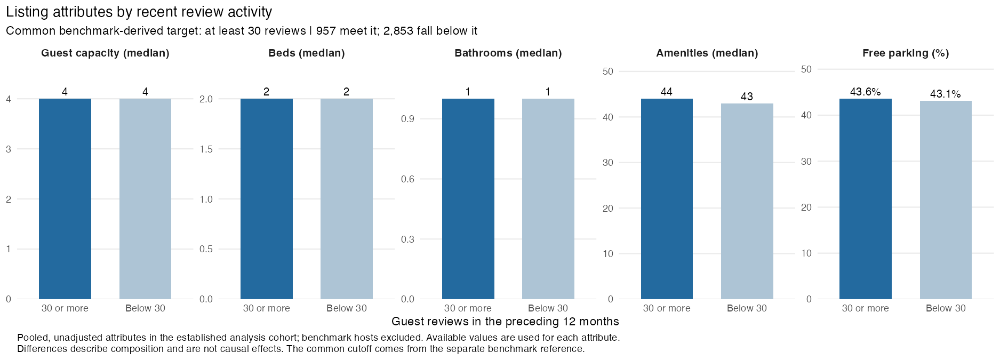

# Descriptive analysis of guest-review activity

[Script 07](../scripts/07_descriptive_analytics.R) summarises the full supplied snapshot. [Script 08](../scripts/08_peer_ranking.R) implements the established residential scope and benchmark partition used by the primary research question. Their populations differ and are identified separately below.

## From the snapshot to the primary analysis

| Stage | Listings |
|---|---:|
| All saved listings | 25,728 |
| Entire homes with 1–3 bedrooms | 16,576 |
| Four standard dwelling types | 14,895 |
| Quoted price AUD30–1,500 | 11,099 |
| First review on or before 1 June 2025 | 6,786 |
| Analysis hosts after removing benchmark hosts, before minimum support | 5,455 |
| Final analysis cells with at least 50 listings | 3,810 |
| Separate benchmark reference in those final cells | 899 |

The reference row is a separate population, not a further restriction of the analysis row. Of the 6,786 history-and-price-eligible listings, 1,331 belong to benchmark hosts. Restricting those to the final 14 analysis cells leaves 899. The analysis has 1,699 hosts and the reference 424, with no overlap. See [scope counts](tables/review_scope_summary.csv) and [partition counts](tables/benchmark_partition_summary.csv).

Established means an observed first review at least a year before the eligibility reference of 1 June 2026. It does not establish opening date or continuous operation. Rental units and condos form Apartment/unit; homes and townhouses form House/townhouse. These categories describe comparable residential stock, not whether a lease or sublet is available.

## Reference distribution and common target

The benchmark reference's P50, P75 and P90 are **14, 30 and 49 reviews**. Its P75 defines the shared integer event of at least 30 reviews. Of the reference listings, 227 meet it (25.2503%), including ties. The main analysis also happens to have P75 30, but its outcomes do not determine the cutoff. It contains **957 qualifying outcomes (25.1181%)** and **333 zero-review listings**, which remain in the denominator.

The full snapshot P75 is 13 reviews; the entire-home, 1–3-bedroom population's P75 is 17. These differ from the scoped reference. The count of 30 is not a whole-market or profitability standard. [Benchmark mappings](tables/benchmark_map_citywide.csv) count listings below, at and above common reference thresholds; segment quantiles do not redefine the outcome.

## Segment comparisons and property attributes

Melbourne 3BR Apartment/unit has the highest observed attainment: **111 of 304 listings (36.51%)**, from 137 hosts. Its pointwise 90% host-cluster interval is **26.54%–46.23%**. These intervals hold the reference cutoff fixed and do not establish a uniquely best location. [The complete ladder](tables/segment_ladder.csv) includes all 14 supported cells.

Listings meeting the target have median amenity count 44 versus 43 below it. Both groups have median capacity four, two beds and one bathroom. Parking shares are 43.57% and 43.11%. These pooled contrasts describe composition rather than causal effects; [the profile table](tables/tier_profile.csv) includes missing-value counts.

## Dwelling composition and history sensitivity

Across all 772 Yarra Ranges entire-home, 1–3-bedroom listings, the four-type whitelist excludes 415 (53.76%). Cottages, guesthouses and farm stays together account for 200 (25.91%). These denominators precede history, price and host-partition filters. They do not show that excluded properties cannot be rented. [The dwelling inventory](tables/excluded_dwelling_types.csv) gives the exact scope.

Two tables compare the whitelist before and after, keeping the same history, quoted-price and non-benchmark-host conditions. [The broad-class table](tables/type_whitelist_sensitivity.csv) groups rental units, condos, serviced apartments and lofts as Apartment-like and all other entire-home types separately. [The paired LGA–bedroom table](tables/type_whitelist_lga_bedrooms_comparison.csv) pools dwelling types to compare the same area and bedroom count. Both mark whether each stage has at least 50 listings. They are composition checks at their stated aggregation levels, not the primary dwelling-class ranking or estimates of a filtering effect.

Removing the history restriction and reapplying minimum support gives **6,675 listings in 22 cells**, including 1,007 zero-review listings. Its P75 is 23, while 1,170 (17.53%) meet the fixed 30-review event. Removing the price restriction but retaining history gives **5,647 listings in 19 cells**, including 1,657 zero-review listings; 1,020 (18.06%) meet the same target. Reference hosts remain excluded in both cases. See [all-history results](tables/segment_ladder_all_histories_sensitivity.csv), [no-price-filter results](tables/segment_ladder_no_price_sensitivity.csv) and [history comparisons](tables/review_exposure_sensitivity.csv).

## Broader data context and limits

The median quoted price is AUD243.67 among 19,175 non-missing values and AUD242.50 among 18,927 within AUD30–1,500. Price and modelled revenue each have 6,553 missing values; bedrooms have 4,679. The review-volume seasonal index uses June 2023–May 2026, excluding the incomplete final observed month. March is 1.252 and June 0.784 relative to an average month of one. These are observed review patterns, not booking forecasts.

Results reproduce from saved processed files. Original CSVs are still needed to verify raw parsing, identifier precision and trailing-year review counts. The revised design follows prior exploration of this snapshot and provides no untouched final test.
