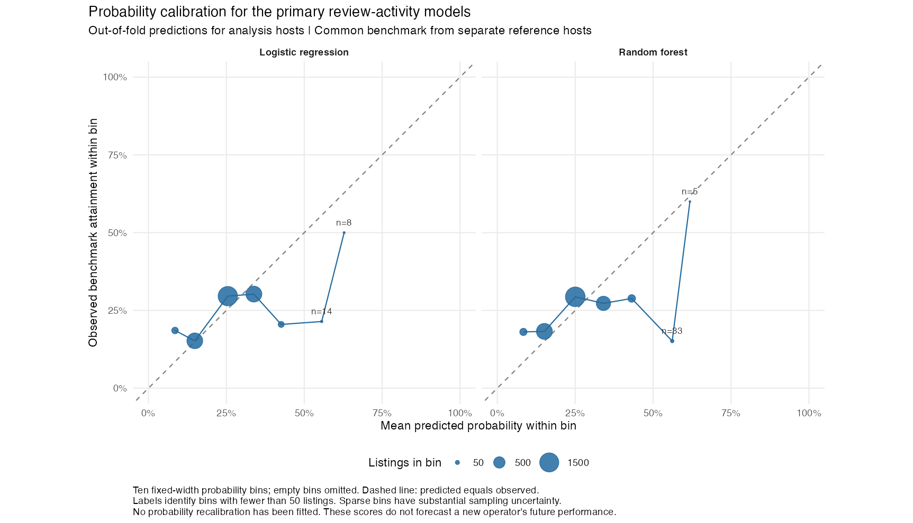

# Current findings

The current research question compares established standard residential segments on a common upper-quartile review-count event over the 365 days ending on each listing's scrape date. The count is derived from reference hosts, not fixed in the RQ. The 15 September results below use reconstructed `reviews_365d` rather than the supplied field, which includes 366 calendar dates. These results do not establish future income or profitability.

## Reference and analysis samples

The final reference contains **906 listings from 426 benchmark hosts**, with pooled **P75 = 29.75**, rounded upward to a **30-review** integer event. A fixed identifier hash assigned these hosts to reference development; none enters model training or evaluation. The primary analysis contains **3,873 listings, 1,726 hosts and 14 segments**, with at least 50 listings after all restrictions. It retains 334 zero-review outcomes. **981 listings (25.3292%)** meet the event. The reference attainment share is 25.0552%; ties prevent an exact quarter.

Established means first review on or before each listing's scrape date minus 365 days. It is not evidence of listing launch or continuous operation. Dwelling and price rules define an explicit comparison population, not lease availability. [The analysis plan](rq-analysis-plan.md) gives every rule and the computational separation of reference and validation outcomes.

## Descriptive evidence

Melbourne 3BR Apartment/unit has the highest observed attainment, **112/306 = 36.60%**. Its pointwise 90% host-cluster interval is **27.30%–45.74%**. [All segments](tables/segment_ladder.csv) include independent-host counts, quantiles, zero outcomes and uncertainty.

Listings meeting the target have median amenity count 44 versus 43 below it, with median capacity four in both groups. These unadjusted contrasts provide limited separation and cannot establish the effects of changing amenities.

## Baseline predictive performance and calibration

Five-fold host-grouped validation gives the following property-only results:

| Model | ROC-AUC | Average precision | Brier score | Precision in highest-scored quarter |
|---|---:|---:|---:|---:|
| Logistic regression | 0.573 | 0.285 | 0.188559 | 30.08% |
| Random forest | 0.560 | 0.280 | 0.191370 | 27.18% |

The sample prevalence is 25.33%; the training-fold-prevalence baseline Brier score is 0.190719. Logistic regression improves this probability-loss measure only slightly; the forest is worse. Discrimination is weak. These results cannot support a confident investment recommendation.

Baseline logistic mean predicted probability is 25.00%, versus 25.33% observed. Its ten-bin weighted absolute calibration error is 3.92 percentage points; the baseline forest's is 5.65. The 22 baseline logistic scores at least 0.5 average 58.2%, yet only 31.8% meet the review benchmark. These few observations illustrate high-score uncertainty and overprediction, not a stable estimate for all future cases. Neither baseline model has a fitted calibration correction. See [bin counts](tables/rq_calibration.csv) and [all eight baseline/scenario results](tables/rq_model_metrics.json).

## Extended models and provisional probability ranking

Adding coordinates, beds and nine amenity indicators improves performance on the same 3,873 listings and unchanged outer host folds. The six fixed candidates give:

| Features and model | ROC-AUC | Average precision | Brier score | Ten-bin calibration error |
|---|---:|---:|---:|---:|
| Extended property-only logistic | 0.607 | 0.310 | 0.186853 | 3.93 pp |
| Extended property-only random forest | 0.640 | 0.350 | 0.181316 | 1.63 pp |
| Extended property-only boosting | 0.647 | 0.359 | 0.182098 | 3.47 pp |
| Extended property-only boosting, sigmoid calibration | 0.637 | 0.355 | 0.181650 | 2.19 pp |
| Extended operating-controls boosting | 0.749 | 0.485 | 0.162356 | 2.22 pp |
| Extended operating-controls boosting, sigmoid calibration | 0.747 | 0.484 | 0.162940 | 3.08 pp |

The extended property-only random forest is provisionally preferred for the RQ's probability ranking because it has the lowest Brier score among the property-only candidates. Its mean predicted probability is 24.98%, against 25.33% observed, and its highest-scored quarter has 37.36% attainment. Boosting ranks outcomes slightly better by AUC but has higher probability loss. The two sigmoid variants use three host-disjoint inner training folds within each outer fold; calibration is not fitted to outer validation outcomes. Its benefits are not uniform, and the preferred forest has no fitted calibration correction. See [all extension metrics](tables/rq_extension_metrics.csv) and [calibration bins](tables/rq_extension_calibration.csv).

Under the extended forest, Melbourne 3BR Apartment/unit ranks first with mean OOF probability **34.45%**, conditional 95% interval **33.00%–35.81%**, and observed attainment **112/306 = 36.60%**. The interval holds model scores and the common cutoff fixed; it excludes model-fitting, benchmark-estimation and model-selection uncertainty. The [extension ranking](tables/rq_extension_ranking.csv) reports every candidate. Candidates were compared after inspecting baseline results, without hyperparameter search or an untouched final test, so the model preference and ranking require independent confirmation.

## Is any model more useful than the segment's historical rate?

A segment-rate baseline answers this directly on the same 3,873 listings, 30-review event and five host folds. Each validation listing receives the attainment rate of its LGA × configuration segment among training hosts, shrunk towards the training-set rate by a prior weight of ten fixed before the run. The smallest training segment has 37 listings, so the shrinkage is immaterial (unsmoothed AUC 0.5806 versus 0.5810).

| Predictor | ROC-AUC | Average precision | Brier score | Ten-bin calibration error | Folds with AUC above the segment rate |
|---|---:|---:|---:|---:|---:|
| Training-fold prevalence (constant) | 0.500 | 0.253 | 0.190719 | — | — |
| **Segment rate, training hosts only** | **0.581** | **0.285** | **0.186789** | **1.78 pp** | — |
| Baseline property-only logistic | 0.573 | 0.285 | 0.188559 | 3.92 pp | 1 of 5 |
| Baseline property-only random forest | 0.560 | 0.280 | 0.191370 | 5.65 pp | 1 of 5 |
| Extended property-only logistic | 0.607 | 0.310 | 0.186853 | 3.93 pp | 3 of 5 |
| Extended property-only random forest | 0.640 | 0.350 | 0.181316 | 1.63 pp | 5 of 5 |
| Extended property-only boosting | 0.647 | 0.359 | 0.182098 | 3.47 pp | 5 of 5 |

**Both original property-only models are worse than the segment rate** on primary-partition AUC and Brier score, and beat it in only one fold of five. This primary comparison does not demonstrate incremental predictive value; the repeated partitions below show that the original logistic model's small advantage is partition-dependent. The extended forest exceeds the segment rate in every primary fold (AUC +0.016 to +0.054 per fold; +0.059 pooled) and has the lower Brier score in every fold; extended boosting does the same. The extended logistic model is ahead in three folds only. Adding contemporaneous price and minimum stay puts every variant ahead in all five folds, but that remains an operating-controls sensitivity.

Every candidate ranks Melbourne 3BR Apartment/unit first, exactly as the training-host rates do. All property-only candidates have the same primary top-three set as the segment-rate baseline; some operating-controls candidates overlap in only two of three. The extended forest's full ranking has Spearman correlation 0.978 with the segment-rate ranking. It improves overall listing-level prediction without changing the principal search candidates. Improvement specifically within segments has not been established by the pooled metrics. The baseline's own ranking, with conditional 95% host-cluster intervals, is in [rq_baseline_segment_ranking.csv](tables/rq_baseline_segment_ranking.csv); see also [the comparison table](tables/rq_baseline_comparison.csv), [per-fold differences](tables/rq_baseline_fold_comparison.csv) and [ranking agreement](tables/rq_baseline_ranking_comparison.csv). Differences are descriptive, on the same rows, and are not significance tests.

For the legally authorised rental-arbitrage client, these results support prioritising property searches, quotations and due diligence in the recurring candidate segments. They do not identify affordable leases, demonstrate subletting permission or establish profitability. If training-internal model selection cannot confirm incremental probability accuracy, the segment-rate baseline will be the primary screening evidence. If refitted uncertainty or scope sensitivity makes the ranking unstable, the final output will be a candidate set rather than a definitive winner.

## Stability under repeated host partitions

Reassigning analysis hosts to five folds under 20 further seeds, with the sample, event, features and model settings fixed, gives:

| Predictor | AUC range over 20 partitions | Mean AUC | Partitions with AUC above the segment rate |
|---|---:|---:|---:|
| Segment rate, training hosts only | 0.569–0.594 | 0.586 | — |
| Baseline property-only logistic | 0.576–0.610 | 0.594 | 17 of 20 |
| Extended property-only random forest | 0.589–0.648 | 0.626 | 20 of 20 |

The primary partition's forest AUC of 0.640 sits in the upper part of its range; the mean across partitions is 0.626, and its margin over the segment rate is 0.015–0.064 (mean 0.040). The original logistic model is ahead of the segment rate in 17 partitions but by 0.008 on average, so its advantage is small and partition-dependent. **Melbourne 3BR Apartment/unit ranks first in all 20 partitions under all three predictors.** Melbourne 2BR Apartment/unit is second in all 20, and Yarra Ranges 3BR House/townhouse third in 19 under the forest (fourth once, swapping with Melbourne 1BR apartments) and in all 20 under the other two. Full results: [rq_repeated_split_summary.csv](tables/rq_repeated_split_summary.csv), [rq_repeated_split_top3.csv](tables/rq_repeated_split_top3.csv). No intervals are computed inside the repeats and no model was added or tuned.

## Baseline segment scores and scope sensitivities

The original baseline logistic ranking places Melbourne 3BR Apartment/unit first, with mean OOF score **34.78%** and conditional 95% interval **33.53%–36.26%**. Melbourne 2BR apartments follow at 31.50%, then Yarra Ranges 3BR houses/townhouses at 27.85%. These intervals hold fitted scores and the benchmark fixed, omit their estimation uncertainty, and do not establish a definitive winner. [The baseline ranking table](tables/rq_oof_segment_ranking.csv) includes both original models and all scenarios.

Adding contemporaneous price and minimum stay gives logistic AUC 0.714 and forest AUC 0.713. This is a separate operating-controls sensitivity, not evidence of prediction from verified pre-opening information. Removing the history restriction yields 6,675 listings in 22 segments, with 17.51% meeting 30; removing the price filter while retaining history yields 5,720 in 19, with 18.29% meeting 30. Both samples have P75 23; the reference event remains unchanged.

The next stage must examine further calibration assessment and broader dwelling mappings, choose models within training data, and report uncertainty with models and thresholds refitted. The design follows prior snapshot exploration; it creates no untouched final test. Current outputs have been rebuilt from raw files with full-listing review reconstruction and matching input hashes. Raw validation confirms the available identifiers, but cannot recover digits already rounded before delivery.
